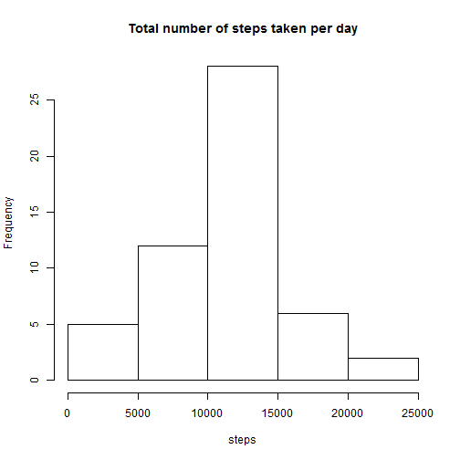
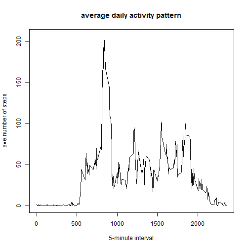
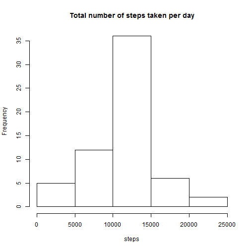
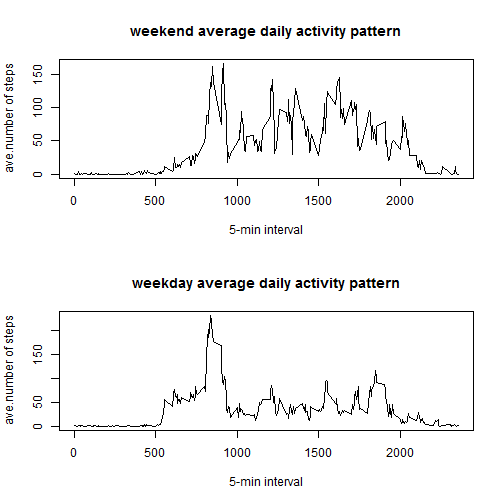

Reproducible Research: Peer Assessment 1
========================================================
This assignment makes use of data from a personal activity monitoring device. This device collects data at 5 mintue intervals throughout the day. The data consists of two monthes of data from an anonymous individual collected during the monthes of October and November, 2012 and includes the number of steps taken in 5 minute intervals each day. This assignment shows the results detailed below.


### 1. load in data

```r
setwd("c:\\DataScience_Reproduce")
data <- read.csv("activity.csv")
```


### 2. display histogram of total number of steps taken everyday (ignor na) 

```r
step_sum <- aggregate(steps ~ date, data = data, sum)
hist(step_sum$steps, main = "Total number of steps taken per day", xlab = "steps")
```

 

### see figure 1


### 3. find mean and median of total number of steps taken per day

```r
mean(step_sum$steps)
```

```
## [1] 10766
```

```r
median(step_sum$steps)
```

```
## [1] 10765
```

### mean: 10766, median:10765


### 4. display a plot: average daily activity pattern 

```r
step_ave <- aggregate(steps ~ interval, data = data, mean)
plot(step_ave$interval, step_ave$steps, type = "l", xlab = "5-minute interval", 
    ylab = "ave.number of steps", main = "average daily activity pattern")
```

 

### see figure 2


### 5. find the interval with maximun steps

```r
interval <- step_ave[which(step_ave$steps == max(step_ave$steps)), ]
interval
```

```
##     interval steps
## 104      835 206.2
```

### average maxiumn steps: 206.2 at interval: 835


### 6. report total number of NA

```r
sum(is.na(data))
```

```
## [1] 2304
```

### number of NA: 2304


### 7. Input missing value with mean of each interval, built new dataset

```r
new_data <- data
index <- which(is.na(data))
new_data[index, 1] <- replace(new_data[index, 1], new_data[index, 3] == step_ave$interval, 
    step_ave$steps)
```


### 8. display histogram of total number of steps taken everyday from new dataset

```r
new_step_sum <- aggregate(steps ~ date, data = new_data, sum)
hist(new_step_sum$steps, main = "Total number of steps taken per day", xlab = "steps")
```

 

### see figure 3


### 9. find the mean and median of the new dataset

```r
mean(new_step_sum$steps)
```

```
## [1] 10766
```

```r
median(new_step_sum$steps)
```

```
## [1] 10766
```

### mean: 10766, median: 10766  (new dataset)


### Comparing the orginal data(with na) and the new data(replace na by mean of corresponding 5-min interval), it shows they have same mean(10766); however, the frequency of total steps is different, the new data has higher frequency. The reason for both is: the missing value is replaced by the corresponding 5-min interval.


### 10. add a new column(day) in the new dataset and define it as 'weekday' or 'weekend' 

```r
new_data$day <- weekdays(as.Date(new_data$date))
new_data$day <- replace(new_data$day, new_data$day == "Saturday" | new_data$day == 
    "Sunday", "weekend")
new_data$day <- replace(new_data$day, new_data$day != "weekend", "weekday")
```


### 11. display plots: average daily activity pattern for 'weekend' and 'weekday'

```r
weekend_data <- subset(new_data[, 1:3], new_data$day == "weekend")
weekday_data <- subset(new_data[, 1:3], new_data$day == "weekday")
weekend_ave <- aggregate(steps ~ interval, data = weekend_data, mean)
weekday_ave <- aggregate(steps ~ interval, data = weekday_data, mean)

par(mfrow = c(2, 1))
plot(weekend_ave$interval, weekend_ave$steps, type = "l", xlab = "5-min interval", 
    ylab = "ave.number of steps", main = "weekend average daily activity pattern")
plot(weekday_ave$interval, weekday_ave$steps, type = "l", xlab = "5-min interval", 
    ylab = "ave.number of steps", main = "weekday average daily activity pattern")
```

 

### see figure 4


### It is observed that average daily activity pattern for 'weekend' and 'weekday' is different. Weekend has two high peaks while weekday has one; however, weekday has a higher average maximum.
